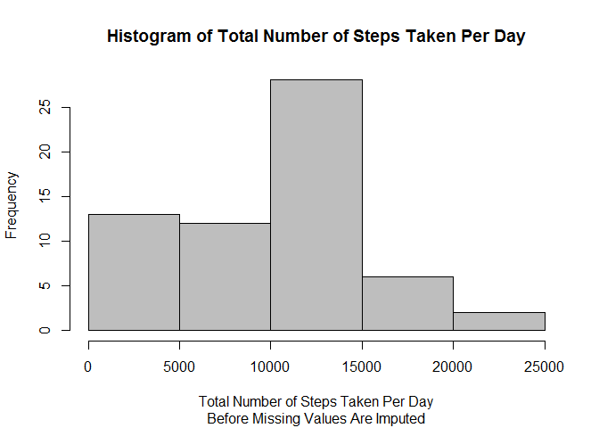
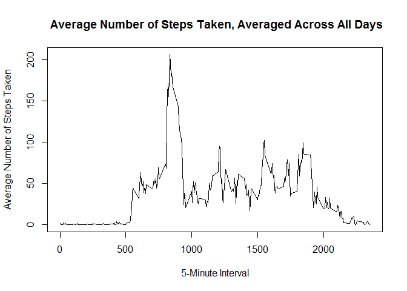
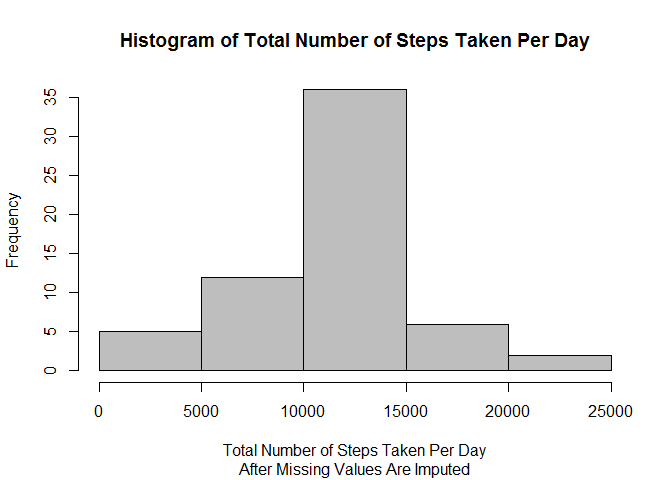
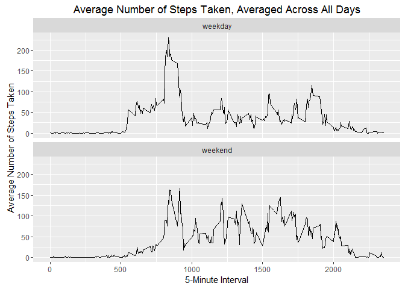

# Reproducible Research: Peer Assessment 1

This assignment makes use of data from a personal activity monitoring device. This device collects data at 5 minute intervals through out the day. The data consists of two months of data from an anonymous individual collected during the months of October and November, 2012 and include the number of steps taken in 5 minute intervals each day.

The data for this assignment can be downloaded from the following link:

Dataset: [Activity monitoring data](https://d396qusza40orc.cloudfront.net/repdata%2Fdata%2Factivity.zip) [52K]

The variables included in this dataset are:

- **steps**: Number of steps taking in a 5-minute interval (missing values are coded as NA)
- **date**: The date on which the measurement was taken in YYYY-MM-DD format
- **interval**: Identifier for the 5-minute interval in which measurement was taken

The dataset is stored in a comma-separated-value (CSV) file and there are a total of 17,568 observations in this dataset.

## Loading and preprocessing the data

1. Unzip the zipped data file, if "activity.csv" is not found in the working directory.


```r
if(!("activity.csv" %in% dir())) {
    unzip("activity.zip")
}
```

2. Load "activity.csv" into R, and assign the dataset to variable "activity".


```r
activity <- read.csv("activity.csv", na.strings = "NA", stringsAsFactors = FALSE)
```

3. Transform the class of variable "date" in the dataset to the Date class.


```r
activity$date <- as.Date(activity$date, "%Y-%m-%d")
options(scipen = 999)
```

## What is mean total number of steps taken per day?

1. Calculate the total number of steps taken per day (ignoring the missing values in the dataset), and assign the result to variable "total_steps".


```r
total_steps <- with(activity, tapply(steps, date, sum, na.rm = TRUE))
```

2. Plot a histogram of the total number of steps taken each day.


```r
hist(total_steps,
     main = "Histogram of Total Number of Steps Taken Per Day",
     xlab = "Total Number of Steps Taken Per Day",
     ylab = "Frequency",
     sub = "Before Missing Values Are Imputed",
     col = "gray")
```

<!-- -->

3. Calculate the mean and median of the total number of steps taken per day (ignoring the missing values in the dataset).


```r
mean_steps <- mean(total_steps, na.rm = TRUE)
median_steps <- median(total_steps, na.rm = TRUE)
```

**The mean of the total number of steps taken per day is 9354.2295082.**  
**The median of the total number of steps taken per day is 10395.**

## What is the average daily activity pattern?

1. Calculate and plot a time series plot of the 5-minute interval (x-axis) and the average number of steps taken, averaged across all days (y-axis).


```r
average_steps <- with(activity, tapply(steps, interval, mean, na.rm = TRUE))
plot(as.numeric(names(average_steps)), average_steps,
     type = "l",
     main = " Average Number of Steps Taken, Averaged Across All Days",
     xlab = "5-Minute Interval",
     ylab = "Average Number of Steps Taken")
```

<!-- -->

2. Calculate and identify which 5-minute interval, on average across all the days in the dataset, contains the maximum number of steps.


```r
max_interval <- as.numeric(names(average_steps)[average_steps == max(average_steps)])
```

**The 5-minute interval, on average across all the days in the dataset, which contains the maximum number of steps is 835.**

## Imputing missing values

1. Calculate and report the total number of missing values in the dataset.


```r
total_na <- sum(is.na(activity$steps))
```

**The total number of missing values in the dataset is 2304.**

2. For filling in all of the missing values in the dataset, the rounded mean for that 5-minute interval is used. Create a new dataset that is equal to the original dataset but with the missing data filled in.


```r
new_activity <- activity
for(i in seq_len(nrow(new_activity))) {
    if(is.na(new_activity$steps[i])) {
        j <- average_steps[names(average_steps) == new_activity$interval[i]]
        new_activity$steps[i] <- round(j)
    }
}
```

3. Plot a histogram of the total number of steps taken each day after missing values are imputed.


```r
new_total_steps <- with(new_activity, tapply(steps, date, sum, na.rm = TRUE))
hist(new_total_steps,
     main = "Histogram of Total Number of Steps Taken Per Day",
     xlab = "Total Number of Steps Taken Per Day",
     ylab = "Frequency",
     sub = "After Missing Values Are Imputed",
     col = "gray")
```

<!-- -->

4. Calculate the mean and median total number of steps taken per day after missing values are imputed.


```r
new_mean_steps <- round(mean(new_total_steps, na.rm = TRUE), 4)
new_median_steps <- median(new_total_steps, na.rm = TRUE)
```

**The new mean of the total number of steps taken per day after missing values are imputed is 10765.6393.**  
**The new median of the total number of steps taken per day after missing values are imputed is 10762.**  
**After missing values are imputed, the mean and median of the total number of steps taken per day are higher.**

## Are there differences in activity patterns between weekdays and weekends?

1. Install the ggplot2 package if it is not installed yet. Load the ggplot2 package.


```r
if(!("ggplot2" %in% installed.packages()))
    install.packages("ggplot2")
library(ggplot2)
```

2. Create a new factor variable in the dataset with two levels - "weekday" and "weekend" indicating whether a given date is a weekday or weekend day.


```r
for(i in seq_len(nrow(new_activity))) {
    if(weekdays(new_activity$date[i]) == "Saturday" |
       weekdays(new_activity$date[i]) == "Sunday") {
        new_activity$day[i] <- "weekend"
    }
    else {
        new_activity$day[i] <- "weekday"
    }
}
new_activity$day <- factor(new_activity$day)
```

3. Make a panel plot containing a time series plot of the 5-minute interval (x-axis) and the average number of steps taken, averaged across all weekday days or weekend days (y-axis).


```r
new_activity$interval.day <- paste(new_activity$interval, new_activity$day, sep = ".")
new_average_steps <- with(new_activity, tapply(steps, interval.day, mean, na.rm = TRUE))
cname <- sapply(names(new_average_steps), strsplit, split = ".", fixed = TRUE)
cname <- sapply(cname, unlist)
df <- data.frame(interval = as.numeric(cname[1,]), day = cname[2,], steps = new_average_steps,
                 row.names = NULL, stringsAsFactors = FALSE)
df <- df[order(df$interval),]

print(ggplot(df, aes(interval, steps, group = day)) +
          geom_line() +
          facet_wrap(~day, nrow = 2, ncol = 1) +
          labs(title = "Average Number of Steps Taken, Averaged Across All Days") +
          labs(x = "5-Minute Interval") +
          labs(y = "Average Number of Steps Taken"))
```

<!-- -->
